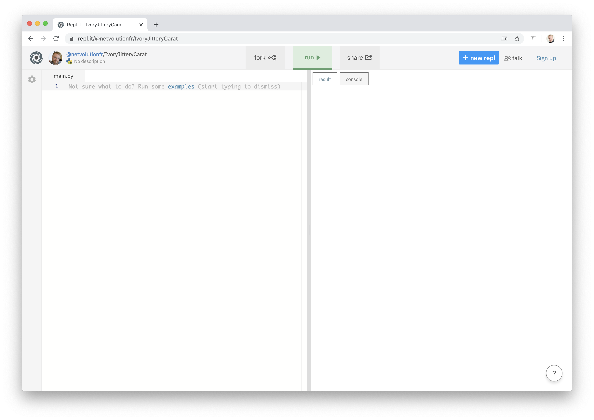

# 1. Environnement de travail

En ligne : utiliser [Repl.it](https://repl.it)

Il est recommandé de créer un compte afin de conserver les projets.

Nous allons créer un projet utilisant la dernière version de Python, et la bibliothèque Turtle. Cette bibliothèque constitue un ensemble d’instructions qui permettent de programmer une « tortue » sous Python, en lui donnant des instructions de déplacement et de tracé, comme si on pilotait un robot avec un crayon.

Créer un nouveau projet en cliquant sur le bouton « New repl », puis choisir « Python (with Turtle) ».

Dans la zone de gauche, vous tapez votre code, et dans la zone de droite, après avoir appuyé sur le bouton vert « run », vous voyez s’afficher le résultat.
