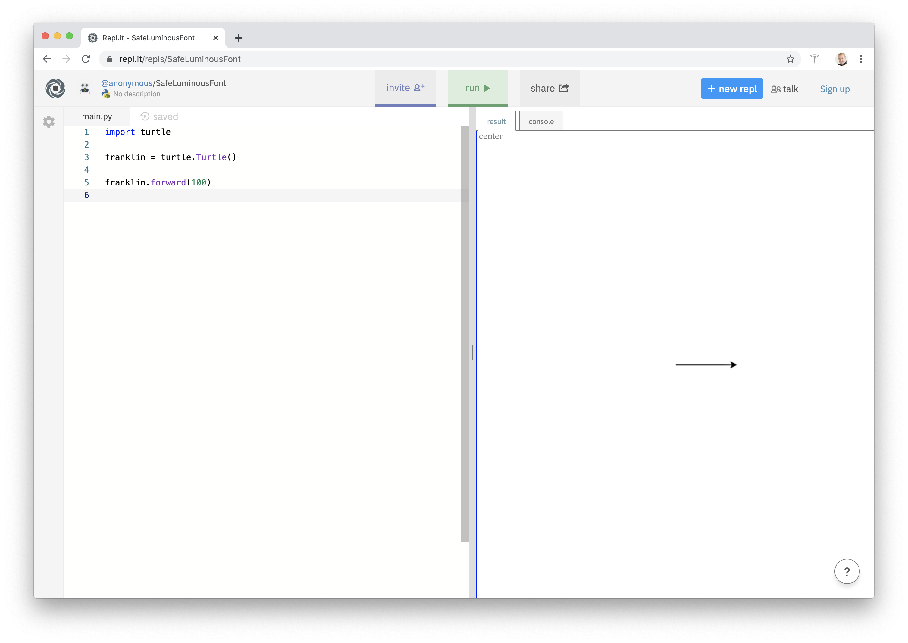
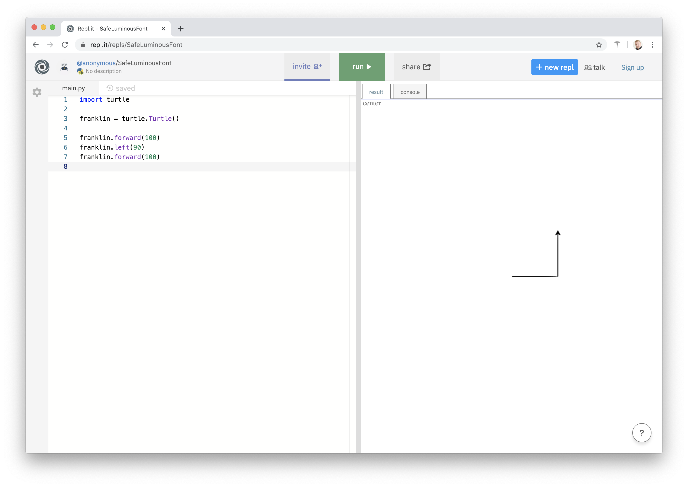

# 2. Faire dessiner la tortue

Il faut d’abord importer la bibliothèque :

```python
import turtle
```

Nous allons maintenant "instancier" une tortue, c'est-à-dire en créer une nouvelle (et lui donner un nom).

Et parce que c'est une tortue, appelons-la "franklin" (je ne vais pas mettre de majuscules).

```python
franklin = turtle.Turtle()
```

Maintenant, je peux donner des instructions à Franklin :

```python
franklin.forward(100)
```



Je peux la faire tourner de 90° sur la gauche (sur SA gauche) puis avancer de nouveau :

```python
franklin.left(90)
franklin.forward(100)
```




## Exercice

Faire tracer un carré à votre tortue.

**Bonus** : vous pouvez changer l'épaisseur du trait avec l'instruction `turtle.width(...)`, ou la couleur `turtle.color(...)`

Variante : modifier le code pour faire dessiner un rectangle.
