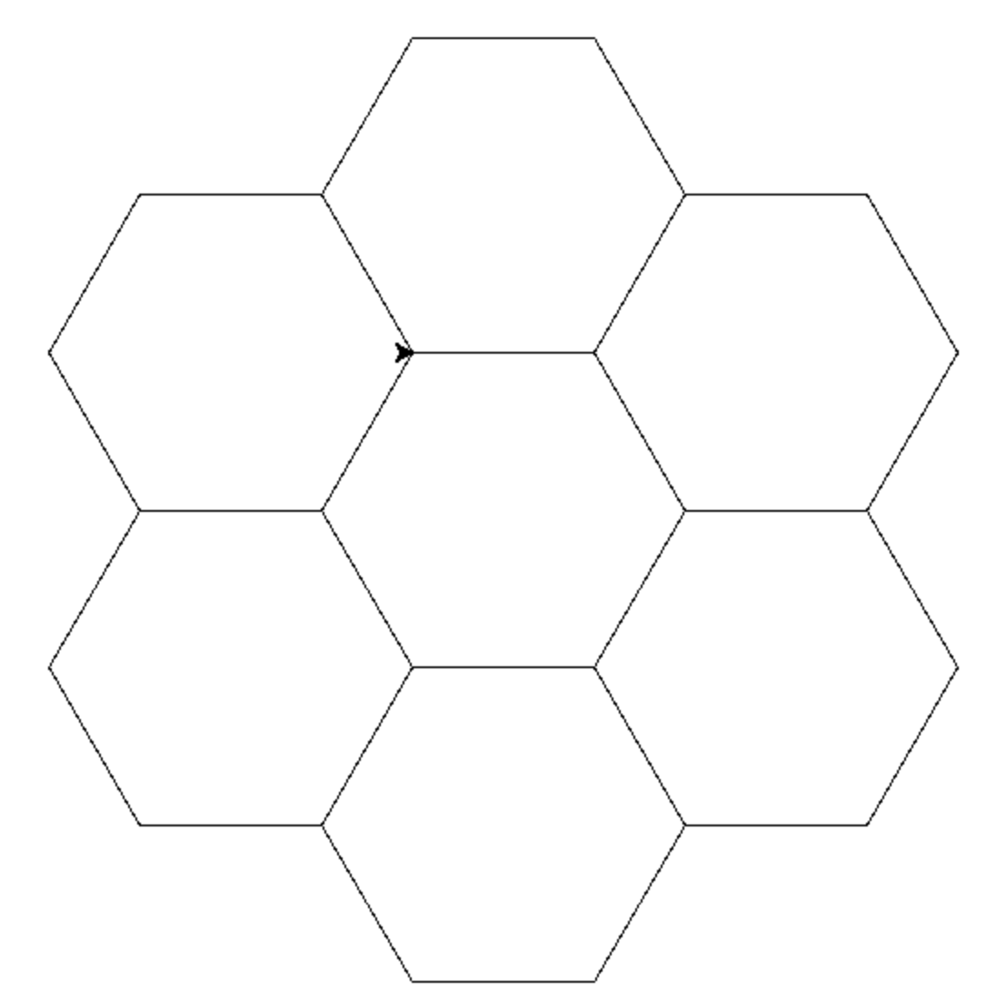

# 5. Fonctions

Pour dessiner un polygone, j'ai utilisé un ensemble d'instructions. Si je donnais un nom à cette suite d'instructions ?

C'est ce qu'on appelle une fonction.

En Python, on donne un nom à notre fonction, et on commence sa description par le petit mot `def`.

```python
def carre():
    for _ in range(4):
    franklin.forward(100)
    franklin.left(90)
```
Puis on fait appel à notre fonction en l'appelant par son nom :
```python
carre()
```
Notez les parenthèses : pour l'instant, elles sont vides.

Mais si je veux créer la fonction qui dessine un polygone à n faces, je dois préciser le nombre de faces. C'est un "paramètre" pour ma fonction.

Et c'est à l'intérieur des parenthèses que je l'indique :

```python
def polygone(n):
    for _ in range(n):
        ...
```

## Défi 1

Créer une fonction "polygone" qui dessine un polygone régulier à n faces

## Défi 2

Écrire un programme qui fasse dessiner un nid d'abeilles comme ceci :



